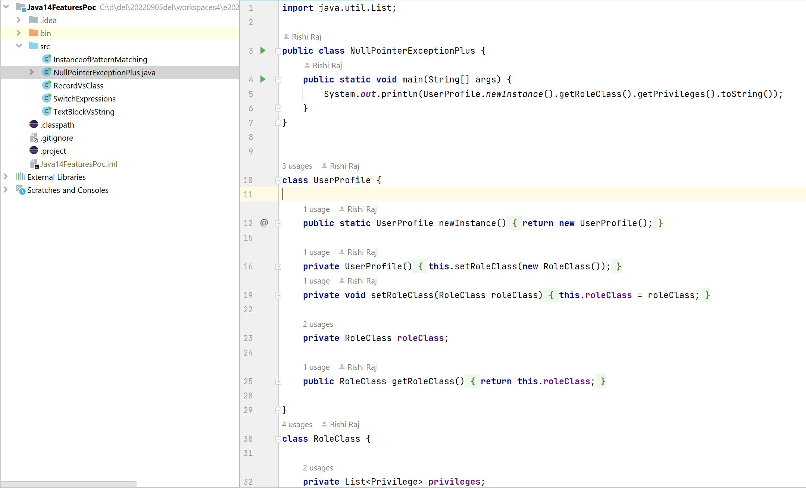
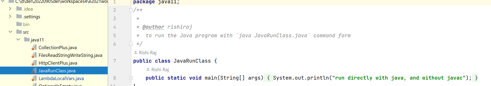
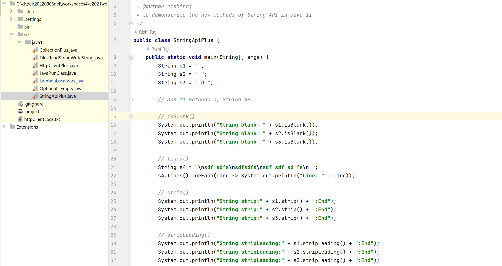

# Core Java: Code Library
- programs and code snippets to showcase the might and versatility of Java platform (as of Core Java API), algorithms implemented using Java language (out of JavaSE), and the types & methods to refer & use in other projects and repositories.  

- First of all, let's start with some of the updates and advancements in Java library (aptly called Java API).

## What's available in Java 21 API
New features available in Java 21 which we missed in Java 17 and earlier versions. Features, which are most notable and stand as the best candidates for frequent use, are listed below:
- Usage of `record` types in conditionals. Very useful with `if(reference instance Type)` tests.
<pre>if(publicParameter instanceof SpecificType) {}</pre>
- labels for `switch` cases. These are very similar to `instanceof` checks.
<pre>
case TierOne test -> future = test.callActionOne();
case TierTwo test -> future = test.callActionTwo();
</pre>
- String literals (a preview feature) to build parameterized text strings. These are similar to string literals / template strings of modern JavaScript and f-strings of python. The template processor `STR` is automatically imported and is available to use without any explicit import or declaration. More template processors include `RAW` and `FMT`. Remember `"fmt"` of Go (Golang)?
<pre>String vmUserName = localSystem.retrieveUserName();
String helloVitrualWorld = STR."Hola \{vmUserName}";</pre>
- One major pathchanger about Java Collection Framework is: the introduction of "sequenced collections": `SequencedCollection`, `SequencedSet` and `SequencedMap`.
<pre>
public interface SequencedCollection<E> extends Collection<E> // since 21
public interface SequencedMap<K, V> extends Map<K, V> // since 21
public interface SequencedSet<E> extends SequencedCollection<E>, Set<E> // since 21
</pre>
- My favorite as it is about security and encryption: Key Encapsulation Mechanism (KEP) to secure symmetric keys.
- TODO: Add updated screenshots
- Implementation examples are in the project code under `Java21API` along with the checklist of which of the features have been tested.

## What's available in Java 17 API
New features available in Java 17 over Java 14. Features, which are most notable and stand as the best candidates for frequent use, are listed below:
- restore always-Strict floating-point semantics: It ensures same results of floating-point calculations on every platform.
- enhanced pseudo-random number generators: class java.util.Random implements interface java.util.random.RandomGenerator. Such new implementations of pseudo random number generators allow for better support for stream-based programming.
- new macOS rendering pipeline
- macOS/AArch64 port
- deprecate the Applet API for removal
- strongly encapsulate JDK internals
- pattern matching for switch (preview)

- remove RMI activation
- sealed classes
- remove the experimental AOT and JIT compilers
- deprecate the Security Manager for removal
- Foreign Function and Memory API (incubator)
- Vector API (second incubator)
- context-specific deserialization filters

### TODO
To add the screenshots for Java 17 features to README for quick illustration. Screenshots are already in `assets` directory.

## What's available in Java 14 API
The additional and formally introduced features available in Java 14. These are the features added to JLS in the versions later to version 11. Most frequently used features are:
- Enhanced `instanceof` operator for safe type conversion: Now use `if (obj instanceof String str)` instead of `if (obj instanceof String)` to get a pre-cooked variable `str` of type `String`, for example, to utilise inside the concerned code block.

- More explanatory NullPointerException message. Run the super-method `main` of `NullPointerExceptionPlus` to get:
<pre>Exception in thread "main" java.lang.NullPointerException: Cannot invoke "Object.toString()" because the return value of "java14.RoleClass.getPrivileges()" is null
	at java14.NullPointerExceptionPlus.main(NullPointerExceptionPlus.java:7)</pre>

- Record as a Type: a smarter tool to fulfill the need of final classes. Example: `record UserRecord(String name, String userId, int pin) {}`

- More consice `switch`. It returns a value, so it is aptly called a switch expression. Example:
<pre>return switch(inputNumber) {
		case 0 -> "zero";
		case 1,3,5,7,9 -> "odd";
		case 2,4,6,8,10 -> "even";
		default -> "Go take some rest.";		
};</pre>

- Text block to assign pre-formatted, with indentation, literal value to a String reference. The value can be supplied without using a reference variable, too. Example:
<pre>String strTextBlock = """
				Das sind die 10 besten Arbeitgeber:innen Deutschlands
				    Platz 1: dm-drogerie markt GmbH + Co. KG
				    Platz 2: Techniker Krankenkasse
				    Platz 3: Ford-Werke GmbH
				    Platz 4: Porsche AG
				    Platz 5: Evonik Industries AG
				    Platz 6: Merck KgaA
				    Platz 7: Bayer AG
				    Platz 8: BMW Group
				    Platz 9: Deloitte
				    Patz 10: Roche Deutschland Holding GmbH
				Und diese Arbeitgeber:innen sind f�r Frauen am besten
				Fazit: Es lohnt sich Firmen-Bewertungen zu checken
				""";
</pre>

## Java 11 API
The nice features available in Java 11 over our good old friend Java 8. Most notable additions are:
- Method `T[] Collection.toArray(IntFunction<T[]> generator )` to use instead of first generating a stream and then invoking `A[] Stream.toArray(IntFunction<A[]> generator);`

- Methods `String Files.readString(Path.of(filePath))` and `Path Files.writeString(Path.of(strFilePath),"string content", StandardOpenOption)`.

- Class `java.net.http.HttpClient` capable of making GET, PUT, POST requests easily.

- Running a Java class directly with `java` command as in `$ java MainClass.java` without generating a `.class` file a priori.

- Usage of `var` keyword for variable declaration in lambda expressions: ` (@Nonnull var a,@Nullable var b) -> System.out.println(a + b)`

- Method `Optional.isEmpty()` to check if the contained value is null. Its definition straight from Java API is:
`public boolean isEmpty() {
        return value == null;
}`

- A number of new methods foster our most-loved class `java.lang.String`. These are: `isBlank()`, `strip()`, `stripLeading()`, `stripTrailing()`, `repeat(intCount)`

## Java Core Snippets
Code fragments and executable programs testing many variants and conditions with standard language features of Java API. Some of the `.java` files here are:
- ArrayIntersection.java
- DefaultElementValue.java
- ExceptionsFinally.java
- FindDuplicatesInArrayByMap.java
- FindDuplicatesInArrayByStream.java
- Main.java
- MainInterface.java
- MedianOfTwoArrays.java
- SecondLargest.java
- SingleInArray.java
- StreamCollectMethods.java
- SuperThisChild.java
- ZeroAndNonZero.java
- innerclasses/{InnerClassInitInOuterClass.java}
- stream/{Address.java  Customer.java  StreamMappingDemo.java}

## Gists
Guidelines on the preferred usage of major Java 8 features and API methods:
- Java 8 DateTime code samples.md
- Java 8 Functional Interfaces in Java API.md
- Java Concurrency API.md
- Java Stream collector-s methods.md

## Notes
- PoC implementations of the gists will keep on adding gradually.

