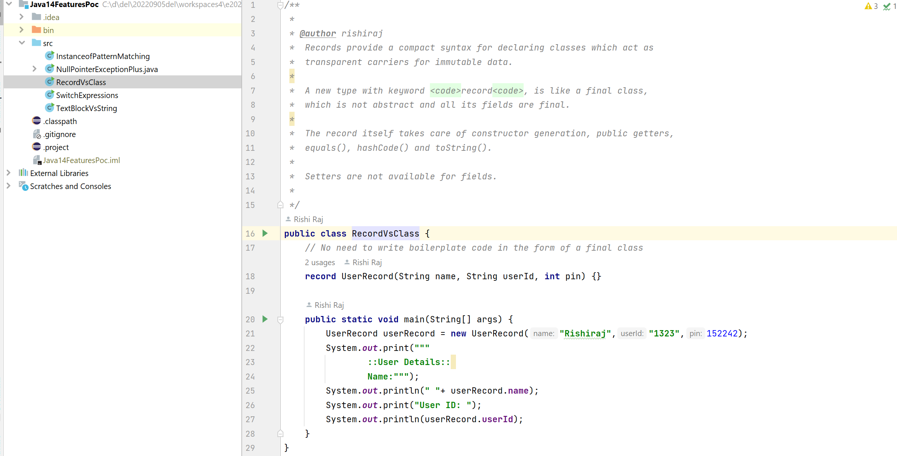

# JavaCoreSnippets
programs and code snippets to showcase the might of Java platform (as of Java API), algorithms implemented using Java language and the types and method to refer and use in other projects.

## Java 11 API
New features available in Java SE 11. These are the features added to JLS in the versions later to Java SE 8. Most frequently used features are:
- Method `T[] Collection.toArray(IntFunction<T[]> generator )` to use instead of first generating a stream and then invoking `A[] Stream.toArray(IntFunction<A[]> generator);`
- Methods `String Files.readString(Path.of(filePath))` and `Path Files.writeString(Path.of(strFilePath),"string content", StandardOpenOption)`.
- Class `java.net.http.HttpClient` capable of making GET, PUT, POST requests easily.
- Running a Java class directly with `java` command as in `$ java MainClass.java` without generating a `.class` file a priori.
- Usage of `var` keyword for variable declaration in lambda expressions: ` (@Nonnull var a,@Nullable var b) -> System.out.println(a + b)`
- Method `Optional.isEmpty()` to check if the contained value is null. Its definition straight from Java API is:
`public boolean isEmpty() {
        return value == null;
}`
- A number of new methods foster our most-loved class `java.lang.String`. These are: `isBlank()`, `strip()`, `stripLeading()`, `stripTrailing()`, `repeat(intCount)`

## Java 14 API
New features available in Java SE 14. These are the features added to JLS in the versions later to Java SE 11. Most frequently used features are:
- Enhanced `instanceof` operator for safe type conversion: Now use `if (obj instanceof String str)` instead of `if (obj instanceof String)` to get a pre-cooked variable `str` of type `String`, for example, to utilise inside the concerned code block.

- More explanatory NullPointerException message. Run the super-method `main` of `NullPointerExceptionPlus` to get:
<pre>Exception in thread "main" java.lang.NullPointerException: Cannot invoke "Object.toString()" because the return value of "java14.RoleClass.getPrivileges()" is null
	at java14.NullPointerExceptionPlus.main(NullPointerExceptionPlus.java:7)</pre>

- Record as a Type: a smarter tool to fulfill the need of final classes. Example: `record UserRecord(String name, String userId, int pin) {}`

- More consice `switch`. It returns a value, so it is aptly called a switch expression. Example:
<pre>return switch(inputNumber) {
		case 0 -> "zero";
		case 1,3,5,7,9 -> "odd";
		case 2,4,6,8,10 -> "even";
		default -> "Go take some rest.";		
};</pre>

- Text block to assign pre-formatted, with indentation, literal value to a String reference. The value can be supplied without using a reference variable, too. Example:
<pre>String strTextBlock = """
				Das sind die 10 besten Arbeitgeber:innen Deutschlands
				    Platz 1: dm-drogerie markt GmbH + Co. KG
				    Platz 2: Techniker Krankenkasse
				    Platz 3: Ford-Werke GmbH
				    Platz 4: Porsche AG
				    Platz 5: Evonik Industries AG
				    Platz 6: Merck KgaA
				    Platz 7: Bayer AG
				    Platz 8: BMW Group
				    Platz 9: Deloitte
				    Patz 10: Roche Deutschland Holding GmbH
				Und diese Arbeitgeber:innen sind f�r Frauen am besten
				Fazit: Es lohnt sich Firmen-Bewertungen zu checken
				""";
</pre>

## Java 17 API
New features available in Java SE 17. These are the features added to JLS in the versions later to Java SE 17. Most frequently used features are listed below:
- restore always-Strict floating-point semantics
- enhanced pseudo-random number generators
- new macOS rendering pipeline
- macOS/AArch64 port
- deprecate the Applet API for removal
- strongly encapsulate JDK internals
- pattern matching for switch (preview)
- remove RMI activation
- sealed classes
- remove the experimental AOT and JIT compilers
- deprecate the Security Manager for removal
- Foreign Function and Memory API (incubator)
- Vector API (second incubator)
- context-specific deserialization filters

//TODO
To insert the screenshots into README for quick illustration. Screenshots are already in `assets` directory.

## Java Core Snippets
Code fragments and executable programs testing many variants and conditions with standard language features of Java API. Some of the `.java` files here are:
- ArrayIntersection.java
- DefaultElementValue.java
- ExceptionsFinally.java
- FindDuplicatesInArrayByMap.java
- FindDuplicatesInArrayByStream.java
- Main.java
- MainInterface.java
- MedianOfTwoArrays.java
- SecondLargest.java
- SingleInArray.java
- StreamCollectMethods.java
- SuperThisChild.java
- ZeroAndNonZero.java
- innerclasses/{InnerClassInitInOuterClass.java}
- stream/{Address.java  Customer.java  StreamMappingDemo.java}

## Gists
Guidelines on the preferred usage of major Java 8 features and API methods:
- Java 8 DateTime code samples.md
- Java 8 Functional Interfaces in Java API.md
- Java Concurrency API.md
- Java Stream collector-s methods.md